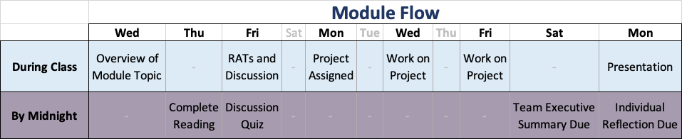

With Module 01 behind us, you're now an expert pandas [data wrangler](https://en.wikipedia.org/wiki/Data_wrangling).

Here's how Module 02 (and every subsequent module) will go:

Before class on Friday, you'll need to complete the [Preparation Reading Assignment](./reading.html).
Complete [Readiness Assurance Test](./RAT-02.pdf).

You might also want to review the introduction to this [module's case study](./intro.html).

[Case Study Project](./project.html)