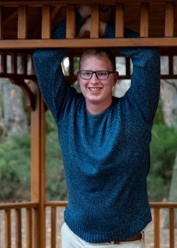

```{r load_libraries, include=FALSE}
source("./site_libs/script.R")
load_libraries()
file <- "index"
```

```{r eval=FALSE}
render_web()
```

<p class="info">This website is setup as a personal portfolio.</p>

`r nav()`



## About Me

BYU-Idaho graduate with a Bachelor's (BS) in Software Engineering. I also earned a minor in Computer Engineering and Data Science. I love to learn new things and solve problems. 

<div `r px0()`><span class="tooltipr">
<a href="javascript:showhide('me')">A little more about me</a>
</span><div id="me" `r px20()`>

```{r about}
print_newline()
print_h4("Societies")
print_soc()
print_newline()
print_h4("Top Skills")
print_skills(datapath)
```

</div></div><br />

```{r main}
print_newline()
print_h2("Contact Me")
print_contact(readcsv(glue("{datapath}contact_info.csv")) %>% filter(in_index))
pagebreak()
print_newline()
print_h2("Highlights")
print_highlights(datapath) 
print_newline()
footer(file)
```
