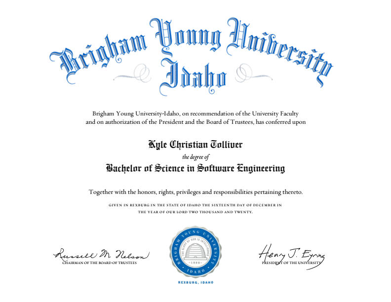

<!--
This program is free software: you can redistribute it and/or modify
it under the terms of the GNU General Public License as published by
the Free Software Foundation, either version 3 of the License, or
(at your option) any later version.

This program is distributed in the hope that it will be useful,
but WITHOUT ANY WARRANTY; without even the implied warranty of
MERCHANTABILITY or FITNESS FOR A PARTICULAR PURPOSE.  See the
GNU General Public License for more details.

You should have received a copy of the GNU General Public License
along with this program.  If not, see <https://www.gnu.org/licenses/>.
-->

```{r load_libraries, include=FALSE}
source("./site_libs/script.R")
datapath <- "./site_libs/data/"
load_libraries()
pos <- read_csv(glue("{datapath}pos.csv"))
```

```{r eval=FALSE}
render_all()
```

`r nav()`

## LinkedIn Learning

<div style="padding-left:1px;">

Used <span class="tooltipr"><a href="javascript:showhide('ll')">LinkedIn Learning</a> 
<span class="tooltipRtext">Courses Include</span></span> to deepen my knowledge and continue learning after getting my Bachelors.
<div id="ll" style="display:none;padding-left:20px;">

```{r}
print_pos(pos, 'LL')
```

</div></div>

`r pagebreak()`

## Brigham Young University - Idaho

I earned a Bachelor's of Science in Software Engineering with a minor in Computer Engineering and Data Science.

<div style="padding-left:1px;">

<span class="tooltipr">
<a href="javascript:showhide('diploma')">Diploma</a>
  <span class="tooltipRtext"><strong>2020 Graduate </strong><br/>My cumulative GPA was <br/> 3.6 out of 4 </span></span>
<div id="diploma" style="display:none;padding-left:20px;">



</div></div>

### Software Engineering (BS)

```{r}
print_pos(pos, 'SE')
```

### Computer Engineering Minor

```{r}
print_pos(pos, 'CE')
```

### Data Science Minor

```{r}
print_pos(pos, 'DS')
```

### Core {.tabset .tabset-fade}

#### Programming

```{r}
print_pos(pos, 'GP')
```

#### Math and Science

```{r}
print_pos(pos, 'GMS')
```

#### General

```{r}
print_pos(pos, 'GE')
```

### {-}

`r pagebreak()`

## Moorpark High School

<div style="padding-left:0px;">

I was able to take some <span class="tooltipr"><a href="javascript:showhide('hs')">college level courses</a></span> in the process of getting my 
<span class="tooltipr" style="padding-left:0px;"><a href="javascript:showhide('hsd')" style="color:gray;">High School Diploma.</a>
<span class="tooltipRtext"><strong>2017 Graduate</strong></span>

<div id="hs" style="display:none;padding-left:20px;">

```{r}
print_pos(pos, 'HS')
```

</div></div>

`r pagebreak()`

<footer><div style="padding-left:0px;">
<span class="tooltipr"><a href="javascript:showhide('copyright')"><p style="color:blue;">`r copyright()`</p></a></span>
<div id="copyright" style="display:none;padding-left:20px;">`r licence(pos)`</div></div></footer>